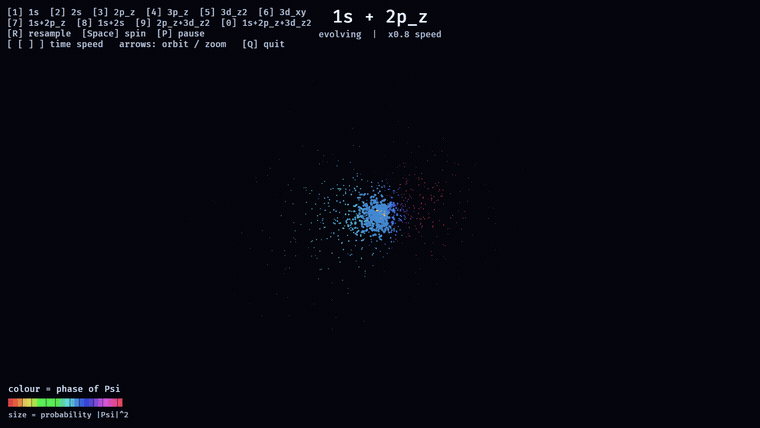
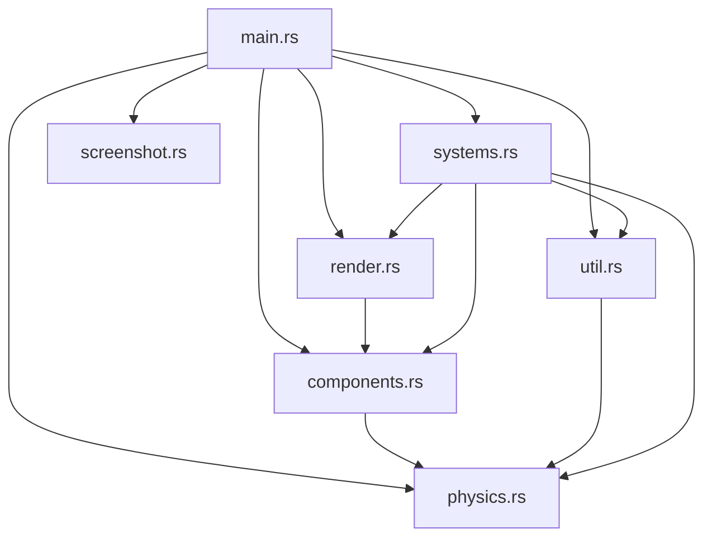
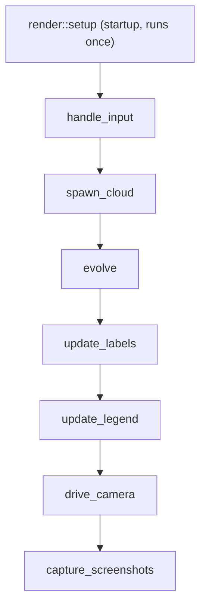

# rrush

A real-time hydrogen-atom visualisation built with the [Bevy](https://bevyengine.org) game engine (0.19).



The proton (nucleus) sits at the origin as a glowing sphere. Around it, a
Monte-Carlo point cloud represents the electron's probability density |ψ|².

* **Single orbitals** are energy eigenstates. Their density is *stationary* —
  only an unobservable global phase turns — so they are drawn as a static
  cloud, coloured by the sign of ψ (blue = +, red = −). This reveals the
  nodal structure of the p and d orbitals.

* **Superpositions of different energy levels** are *not* stationary: the
  cross terms make the charge density slosh at the Bohr frequencies
  ω = (Eₙ − Eₘ)/ħ. These are animated — every point's size tracks the
  instantaneous |Ψ(r,t)|² and its colour tracks the local phase arg(Ψ), so
  you can watch the electron density move. The animation above is
  **1s + 2p_z**, an oscillating electric dipole: the cloud sloshes back and
  forth along z while its phase rotates.

A single stationary orbital — the **3d_z²**, with its blue axial dumbbell
(ψ > 0) and red equatorial torus (ψ < 0) — looks like this:


## Run

```sh
cargo run --release
# open directly in a state (see keys below), e.g. the 1s+2p_z dipole:
cargo run --release -- 7
```

The first build compiles Bevy and takes a while; subsequent builds are fast.

The current state is labelled at the top of the window, and a colour legend in
the bottom-left corner explains the point colours: blue/red for the sign of ψ
in a stationary orbital, or a hue wheel for the phase arg(Ψ) of an evolving
superposition (where point size tracks the probability |Ψ|²).

## Controls

| Key       | Action                                                   |
|-----------|----------------------------------------------------------|
| `1`–`6`   | Single orbital: 1s, 2s, 2p_z, 3p_z, 3d_z², 3d_xy         |
| `7`–`0`   | Superposition: 1s+2p_z, 1s+2s, 2p_z+3d_z², 1s+2p_z+3d_z² |
| `R`       | Resample the current cloud                               |
| `Space`   | Toggle auto-rotation                                     |
| `P`       | Pause / resume time                                      |
| `[` / `]` | Slow down / speed up time                                |
| `←` / `→` | Orbit the camera                                         |
| `↑` / `↓` | Zoom in / out                                            |
| `Q`       | Quit                                                     |

## Project structure

The source is split into focused modules under `src/`. The physics is kept
free of any Bevy dependency, which makes it directly testable:

| Module           | Responsibility                                             |
|------------------|-----------------------------------------------------------|
| `main.rs`        | App wiring: window, resources, system schedule, constants |
| `physics.rs`     | Orbitals and the quantum state (Bevy-free) + unit tests   |
| `components.rs`  | ECS resources and component tags                          |
| `render.rs`      | One-time scene setup and the colour palette               |
| `systems.rs`     | The per-frame update systems                              |
| `screenshot.rs`  | Scripted stills / GIF frames (`RRUSH_SHOT`)               |
| `util.rs`        | Small stateless helpers                                   |

Module dependencies (an arrow means "uses"):



## How a frame runs

`render::setup` builds the static scene once at startup. Then, every frame,
the `Update` systems run in a fixed (chained) order:



Everything from `handle_input` onward is part of the per-frame `Update`
schedule; only `render::setup` runs once, at startup.

* `handle_input` picks the state, steers the camera, and drives the clock.
* `spawn_cloud` runs only when the state changes: it rejection-samples fresh
  fixed point positions from the time-averaged envelope density.
* `evolve` advances the clock and, for a superposition, updates every point's
  size and colour from the instantaneous amplitude.
* `update_labels`, `update_legend`, and `drive_camera` keep the overlays and
  camera in sync; `capture_screenshots` writes stills when `RRUSH_SHOT` is set.

## Physics

Wave functions are written in atomic units (Bohr radius *a₀* = 1, ħ = 1) and
normalised so that ∫|ψ|²dV = 1, so an equal-coefficient superposition is an
equal-*probability* mixture. Energies are Eₙ = −1/(2n²) Hartree. The
time-dependent state is

Ψ(r, t) = Σₖ cₖ ψₖ(r) e^(−iEₖt).

Fixed sample points are drawn once (by rejection sampling) from the
time-averaged envelope Σ cₖ²ψₖ²; each frame their size and colour are updated
from the instantaneous amplitude. Every preset combines orbitals with
distinct principal number n, so the cross terms produce genuine motion.

The unit tests in `src/physics.rs` verify this numerically: for 1s + 2p_z the
charge centre ⟨z⟩ oscillates and flips sign every half period, while the
time-averaged envelope stays centred at the origin.

```sh
cargo test
```

## Options

* `rrush <state>` — start in a given state (`1`–`6` orbitals, `7`–`0` presets).
* `RRUSH_STILL=1` — start without auto-rotation (a steady side-on view).
* `RRUSH_SPEED=0.8` — fix the animation speed, overriding the per-state
  default (handy for smooth, slow frame capture).
* `RRUSH_SHOT=out.png RRUSH_SHOT_T=1.6,3.7` — save screenshots at the given
  times (seconds); an index is inserted before the extension
  (`out_0.png`, `out_1.png`). Handy for generating doc stills.
* `RRUSH_FPS=1` — log frame-time diagnostics to the console.
