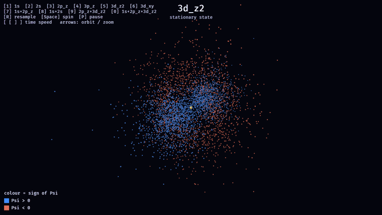

# rrush

A real-time hydrogen-atom visualisation built with the [Bevy](https://bevyengine.org) game engine (0.19).



The proton (nucleus) sits at the origin as a glowing sphere. Around it, a
Monte-Carlo point cloud represents the electron's probability density |ψ|².

* **Single orbitals** are energy eigenstates. Their density is *stationary* —
  only an unobservable global phase turns — so they are drawn as a static
  cloud, coloured by the sign of ψ (blue = +, red = −). This reveals the
  nodal structure of the p and d orbitals.

* **Superpositions of different energy levels** are *not* stationary: the
  cross terms make the charge density slosh at the Bohr frequencies
  ω = (Eₙ − Eₘ)/ħ. These are animated — every point's size tracks the
  instantaneous |Ψ(r,t)|² and its colour tracks the local phase arg(Ψ), so
  you can watch the electron density move. For example, **1s + 2p_z** is an
  oscillating electric dipole: the cloud sloshes back and forth along z while
  its phase rotates.

## Run

```sh
cargo run --release
# open directly in a state (see keys below), e.g. the 1s+2p_z dipole:
cargo run --release -- 7
```

The first build compiles Bevy and takes a while; subsequent builds are fast.

The current state is labelled at the top of the window, and a colour legend in
the bottom-left corner explains the point colours: blue/red for the sign of ψ
in a stationary orbital, or a hue wheel for the phase arg(Ψ) of an evolving
superposition (where point size tracks the probability |Ψ|²).

## Controls

| Key       | Action                                                   |
|-----------|----------------------------------------------------------|
| `1`–`6`   | Single orbital: 1s, 2s, 2p_z, 3p_z, 3d_z², 3d_xy         |
| `7`–`0`   | Superposition: 1s+2p_z, 1s+2s, 2p_z+3d_z², 1s+2p_z+3d_z² |
| `R`       | Resample the current cloud                               |
| `Space`   | Toggle auto-rotation                                     |
| `P`       | Pause / resume time                                      |
| `[` / `]` | Slow down / speed up time                                |
| `←` / `→` | Orbit the camera                                         |
| `↑` / `↓` | Zoom in / out                                            |

## Physics

Wave functions are written in atomic units (Bohr radius *a₀* = 1, ħ = 1) and
normalised so that ∫|ψ|²dV = 1, so an equal-coefficient superposition is an
equal-*probability* mixture. Energies are Eₙ = −1/(2n²) Hartree. The
time-dependent state is

Ψ(r, t) = Σₖ cₖ ψₖ(r) e^(−iEₖt).

Fixed sample points are drawn once (by rejection sampling) from the
time-averaged envelope Σ cₖ²ψₖ²; each frame their size and colour are updated
from the instantaneous amplitude. Every preset combines orbitals with
distinct principal number n, so the cross terms produce genuine motion.

The unit tests in `src/main.rs` verify this numerically: for 1s + 2p_z the
charge centre ⟨z⟩ oscillates and flips sign every half period, while the
time-averaged envelope stays centred at the origin.

## Options

* `rrush <state>` — start in a given state (`1`–`6` orbitals, `7`–`0` presets).
* `RRUSH_STILL=1` — start without auto-rotation (a steady side-on view).
* `RRUSH_SHOT=out.png RRUSH_SHOT_T=1.6,3.7` — save screenshots at the given
  times (seconds); an index is inserted before the extension
  (`out_0.png`, `out_1.png`). Handy for generating doc stills.
